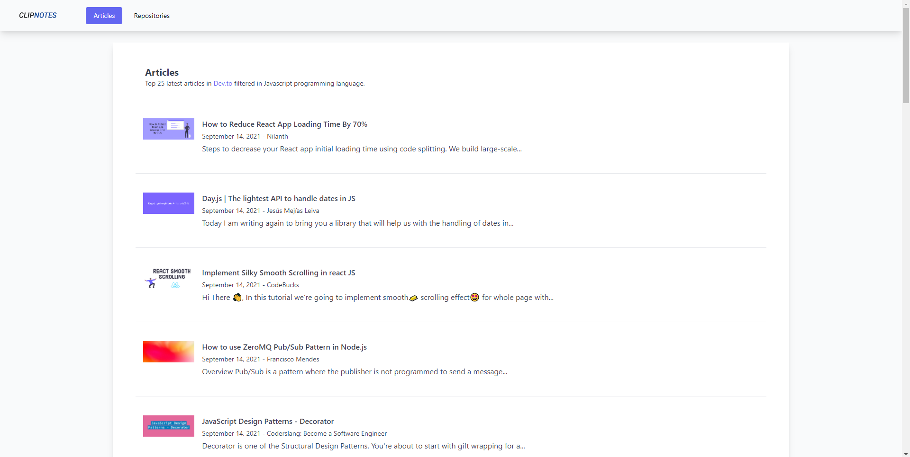

## CLIPNOTESv2

: A web application that collates the latest articles from dev.to & daily trending repositories from Github filtered by Javascript programming language.

: This was made to solve the problem of the author by visiting multiple websites just to read trending technologies in Javascript.

The web application is deployed in vercel [CLIPNOTES](https://clipnotes.vercel.app "Clipnotes web application").
