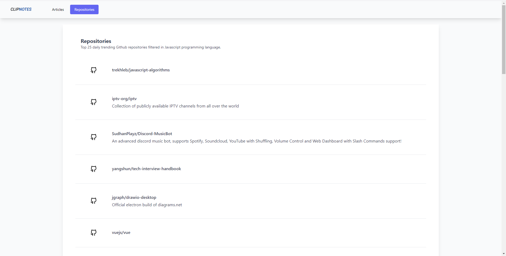

## CLIPNOTES.v2

A web application that collates the latest articles from [Dev.to](https://dev.to "Dev.to official website") & daily trending repositories from [Github](https://github.com/trending "Github trending repositories") filtered in Javascript programming language.

This was made to solve the problem of the author by visiting multiple websites just to read trending technologies in Javascript.

**Live Website**: [https://clipnotes.vercel.app](https://clipnotes.vercel.app "The web application is deployed in vercel.")

**Articles page**

**Repositories page**

